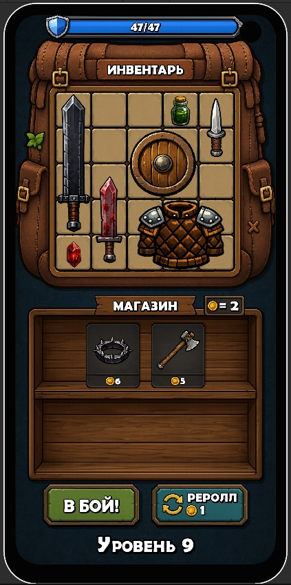
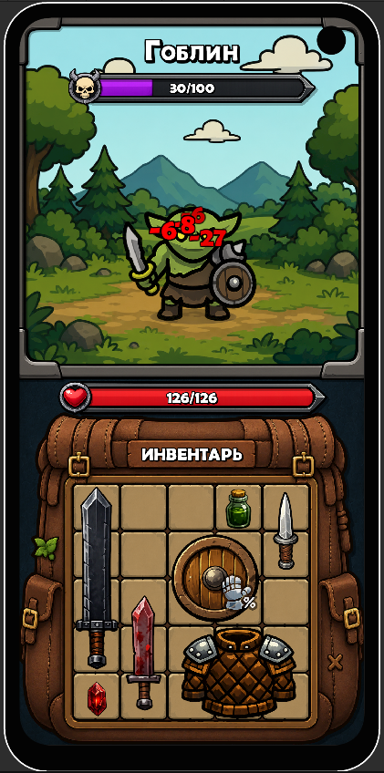
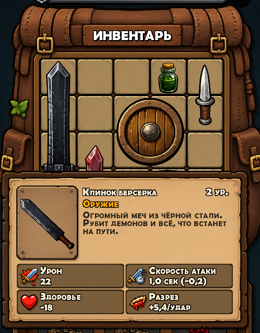

# Puzzle Pack

Инвентарный пазл + автобаттлер на Unity.

## Геймплей

Собирай инвентарь из предметов разной формы на сетке 5×5. Предметы дают характеристики: урон, скорость атаки, броню, здоровье, яд, поджог, казнь и десятки других. Предметы влияют друг на друга через ауры и глобальные баффы. После нажатия «В бой» начинается автоматический бой с врагами.

## Механики

- **Инвентарь-пазл:** перетаскивание предметов, слияние одинаковых (1+1=2, 2+2=3)
- **Ауры:** предметы влияют на соседние клетки
- **Магазин:** покупка, продажа, рероллы, скидки
- **Автобой:** 20+ характеристик, мана-система, магические и обычные предметы
- **Прогрессия:** 100 уровней, 7 архетипов билдов

## Платформы

Android, iOS, WebGL

## Скриншоты

## Статус

<<<<<<< Updated upstream
В разработке. Текущая версия: 18 предметов, тестирование механик.
=======
В разработке. Текущая версия: 18 предметов, тестирование механик.
>>>>>>> Stashed changes
